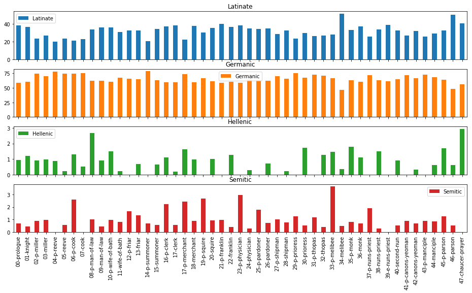
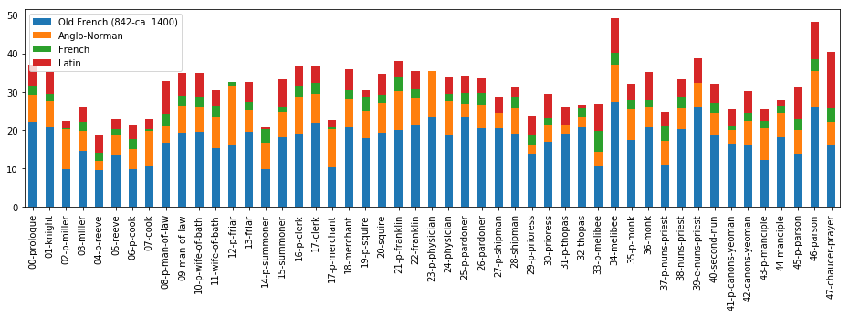

--- 
title: A Macro-Etymological Analysis of _The Canterbury Tales_
author: Jonathan Reeve
bibliography: '/home/jon/Dropbox/Papers/library.bib' 
figureTitle: Figure
figPrefix: Figure
---

# Methods
## The Text

Since this analysis relies on tools of natural language processing that are best suited to handling modern English, I used an edition that regularizes and modernizes Chaucer's spelling: Project Gutenberg's e-text of D. Laing Purves's 1870s edition, made "for popular perusal." It is neither a complete translation, which would change the etymologies of many words, nor even a complete spelling modernization. As Purves describes it, "where the old spelling or form seemed essential to metre, to rhyme, or meaning, no change has been attempted. But, wherever its preservation was not essential, the spelling of the monkish transcribers---for the most ardent purist must now despair of getting at the spelling of Chaucer himself---has been discarded for that of the reader's own day" [@chaucer_canterbury_2000 n.p.]. I manually divided the text into prologues, tales, and epilogues, and then parsed each line programmatically, removing glosses, footnotes, and other artifacts.

## The Algorithm
MacroEtym uses a very opinionated algorithm for determining the etymology of a word that deserves a brief description. It first tokenizes a text using [Penn Treebank conventions](http://www.nltk.org/api/nltk.tokenize.html#module-nltk.tokenize.treebank), removes stopwords (common functional words like "a" and "the" that don't contribute much to the analysis), infers their parts of speech, and lemmatizes the tagged results, regularizing plurals to their singular forms, and verbs to their bare infinitives. Then, it will search for the word in the [Etymological Wordnet](http://www1.icsi.berkeley.edu/~demelo/etymwn/), a database created from parsing Wiktionary etymological data [@deMeloEtymWN2014].

If the word is found, but its ancestors are determined to belong to the same language as the original (for instance, modern English words composed by conjoining two other English words), or if the ancestor belongs to a "middle" language variant, like Middle English, MacroEtym will search for another ancestor. For all other words, the first ancestor is used. This logic is intended to foreground meaningful etymological resonances. This means that the few Old English words that are actually of Latin derivation, are labeled as Old English, but this might be considered a feature, since these words tend to be indistinguishable from Germanic words to the modern ear. In addition to ignoring current languages, MacroEtym also ignores affixes by default. Rather than parse a word like "automobile" as, say, 40% Greek (-_auto_) and 60% Latin (-_mobile_), it just considers these prefixes, like stopwords, to be background functions of the language, and incidental to the etymological resonance of the word, which in this case would be labeled as Latin.

If a given lemma is not found in the Etymological Wordnet, MacroEtym will attempt a custom lemmatization of the word according to morphological patterns of Middle English. If the lemma is still not found, it will search for the lemma in a secondary etymological wordnet of 19,135 words of Middle English, which I created from parsing all the word forms listed in the Project Gutenberg edition of A.L. Mayhew and Walter Skeat's 1888 _A Concise Dictionary of Middle English_. If not found there, it will finally search for the word in an experimental tertiary wordnet of 38,074 words, awkwardly assembled by parsing the irregular etymological strings from a plain-text edition of the Oxford English Dictionary.

One a word is found in one of the three wordnets, it is then categorized according to language family, the biggest categories being Germanic, containing words of Old English, German, Dutch, and Scandinavian origin; Latinate, containing words of Latin, French, Italian, and Spanish origin; Hellenic, containing mostly words of Ancient Greek origin; and Semitic, containing words of Hebrew origin.

# Results

## Prologues and Tales

{#fig:families}

[@fig:families] shows the proportions of Latinate, Germanic, Hellenic, and Semitic language families, organized by tale. Immediately noticeable here is that the scales are quite different: proportions of Germanic words fluxuate between 50 and 75 percent (these numbers are actually much higher without stopwords removed); proportions of Latinate words fall between 20 and 50 percent, and Hellenic and Semitic words are both all under three percent of the total. Since some of these texts are quite short---Chacuer's final "retraction," for instance, is only 369 words---we should treat the final two language families with some degree of suspicion, since in those cases, the fluctuations here reflect only the difference of about eleven words. It is for this reason that I will be focusing primarily on Latinate words here. 

{#fig:latinate}

[@fig:latinate] shows the proportions of Latinate words per tale, subdivided into individual languages. Broadly speaking, the prologues and tales with the highest proportions of Latinate words are the prose tales: the Chaucer character's Tale of Melibee at 51.6%, and the Parson's Tale, at 50.33%. Chaucer's final retraction, also in prose, is at 41.0%, and the next highest tales are the Franklin's prologue, at 40.4%, the Nun's Priest's Tale at 38.7%, and the Clerk's, at 38.5%. The tales with the lowest proportions of Latinate words are all prologues: the Reeve's at 19.9%, the Cook's at 21.7%, the Summoner's at 21.9%, and the Miller's, at 22.3%. 

# Works Cited
