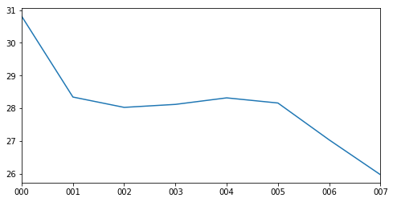

--- 
title: A Macro-Etymological Analysis of _The Canterbury Tales_
author: Jonathan Reeve
bibliography: '/home/jon/Dropbox/Papers/library.bib' 
figureTitle: Figure
figPrefix: Figure
---

# Methods
## The Text

Since this analysis relies on tools of natural language processing that are best suited to handling modern English, I used an edition that regularizes and modernizes Chaucer's spelling: Project Gutenberg's e-text of D. Laing Purves's 1870s edition, made "for popular perusal" [@chaucer_canterbury_2000 n.p.]. It is neither a complete translation, which would change the etymologies of many words, nor even a complete spelling modernization. As Purves describes it, "where the old spelling or form seemed essential to metre, to rhyme, or meaning, no change has been attempted. But, wherever its preservation was not essential, the spelling of the monkish transcribers---for the most ardent purist must now despair of getting at the spelling of Chaucer himself---has been discarded for that of the reader's own day." I manually divided the text into prologues, tales, and epilogues, and then parsed each line programmatically, removing glosses, footnotes, and other artifacts.

## The Algorithm
MacroEtym uses an opinionated algorithm for determining the etymology of a word, and one that deserves a brief description. It begins by tokenizing a text using [Penn Treebank conventions](http://www.nltk.org/api/nltk.tokenize.html#module-nltk.tokenize.treebank), then removes stopwords (common functional words like "a" and "the" that don't contribute much to the analysis), infers their parts of speech, and lemmatizes the tagged results, regularizing plurals to their singular forms, and verbs to their bare infinitives. Then, it will search for the word in the [Etymological Wordnet](http://www1.icsi.berkeley.edu/~demelo/etymwn/), a database created from parsing Wiktionary etymological data [@deMeloEtymWN2014].

If the word is found, but its ancestors are determined to belong to the same language as the original (for instance, modern English words composed by conjoining two other English words), or if the ancestor belongs to a "middle" language variant, like Middle English, MacroEtym will search for another ancestor. For all other words, the first ancestor is used. This logic is intended to foreground meaningful etymological resonances. This means that the few Old English words that are actually of Latin derivation, are labeled as Old English, but this might be considered a feature, since these words tend to be indistinguishable from Germanic words to the modern ear. In addition to ignoring current languages, MacroEtym also ignores affixes by default. Rather than parse a word like "automobile" as, say, 40% Greek (-_auto_) and 60% Latin (-_mobile_), it just considers these prefixes, like stopwords, to be background functions of the language, and incidental to the etymological resonance of the word, which in this case would be labeled as Latin.

If a given lemma is not found in the Etymological Wordnet, MacroEtym will attempt a custom lemmatization of the word according to morphological patterns of Middle English. If the lemma is still not found, it will search for the lemma in a secondary etymological wordnet of 19,135 words of Middle English, which I created from parsing all the word forms listed in the Project Gutenberg edition of A.L. Mayhew and Walter Skeat's 1888 _A Concise Dictionary of Middle English_. If not found there, it will finally search for the word in an experimental tertiary wordnet of 38,074 words, awkwardly assembled by parsing the irregular etymological strings from a plain-text edition of the Oxford English Dictionary.

One a word is found in one of the three wordnets, it is then categorized according to language family, the biggest categories being Germanic, containing words of Old English, German, Dutch, and Scandinavian origin; Latinate, containing words of Latin, French, Italian, and Spanish origin; Hellenic, containing mostly words of Ancient Greek origin; and Semitic, containing words of Hebrew origin.

# Results

## Prologues and Tales

{#fig:families}

[@fig:families] shows the proportions of Latinate, Germanic, Hellenic, and Semitic language families, organized by tale. Immediately noticeable here is that the scales are quite different: proportions of Germanic words fluxuate between 50 and 75 percent (these numbers are actually much higher without stopwords removed); proportions of Latinate words fall between 20 and 50 percent, and Hellenic and Semitic words are both all under three percent of the total. Since some of these texts are quite short---Chacuer's final "retraction," for instance, is only 369 words---we should treat the final two language families with some degree of suspicion, since in those cases, the fluctuations here reflect only the difference of about eleven words. It is for this reason that I will be focusing primarily on Latinate words here. 

{#fig:latinate}

[@fig:latinate] shows the proportions of Latinate words per tale, subdivided into individual languages. Broadly speaking, the prologues and tales with the highest proportions of Latinate words are the prose tales: the Chaucer character's Tale of Melibee at 51.6%, and the Parson's Tale, at 50.33%. Chaucer's final retraction, also in prose, is at 41.0%, and the next highest proportions are in Franklin's prologue, at 40.4%, the Nun's Priest's Tale at 38.7%, and the Clerk's, at 38.5%. Yet this macro-etymological analysis is not just detecting a prose signal, as opposed to one of metered poetry, as I will discuss later. There might be a few reasons why Latinate words appear more often in prose. First, the metrical requirements of Chaucer's line might not as easily allow many contiguous multisyllabic words, as are typical of many Latinate words; they are allowed in prose. Next, the prose modes of The Canterbury Tales are all dramatic departures from their environs, dramatic in both in intensity and theatricality, so it is fitting that their etymological modes are also contrasting. 

Conversely, the tales with the lowest proportions of Latinate words are all prologues, and with the exception of the Summoner's, all from Fragment I: the Reeve's at 19.9%, the Cook's at 21.7%, the Summoner's at 21.9%, and the Miller's, at 22.3%. Unlike other prologues in the _Canterbury Tales_, these feature a high incidence of dialogue, which might be expected to have fewer Latinate words than the more constructed modes of many of the tales.   

One important facet of this Latinate proportions analysis is its jagged, sawtooth shape across contiguous tales in a given fragment. The first of these patterns appears between the Knight's tale and the Miller's prologue: there is a sharp drop in proportions of Latinate words, indicating a sharp difference in tonality. The inflated tone of the Knight's tale, which ends with a happy wedding, or rather, the Latin _matrimoigne_ and French _mariage_ (I.3095), is quickly deflated by the Miller, who "for dronken was al pale," and who swears, using words that would be at home in _Beowulf_, "By armes, and by blood and bones, / I kan a noble tale for the nones, / With which I wol now quite the Knyghtes tale" (I.3125-7). The Miller's tale itself, as most tales do, shows a higher proportion of Latinate words than its prologue, but this elevation is temporary, for the quiting dynamic that the Miller inaugurates is continued with even greater force by the Reeve, whose prologue shows the lowest proportion of Latinate words in the fragment. The etymological trend within these fragments is one of Latinate oratorial floridity answered by raw, punchy Germanic talk.  

Another notable quiting exchange, and one which is also observable along this etymological axis, is that between the Friar and the Summoner. There, the quiting dynamic reaches its apotheosis: the Friar's tale explicitly concerns a corrupt Summoner, who is literally a devil in disguise. And lest we believe, after this, that the satirical depictions of fellow pilgrims couldn't get any more profane, the Summoner's Prologue answer this with a scene where "out of the develes ers ther gonne dryve / Twenty thousand freres" (III.1694-5). This contrasts greatly with the Latinate moral lesson with which the Summoner ends his tale, and the contrast is clearly shown in the macro-etymological analysis.  

A third pair, and one that exhibits one of the most dramatic shifts in etymological tone, is that between the Clerk's tale and the Merchant's prologue. The Clerk, who has been forewarned by the Host to "Speketh so plain at this time, ... / That we may understonde what ye seye" (IV.19-20), nonetheless embarks on a verbose tale, full of verbal flourishes. The tale is set in Italy, and represents a relatively faithful translation of from the Petrarchan story _De obedienta ac fide uxoria mythologie_, a fact which may help to explain the high incidence of Latinate words [@chaucer_riverside_2008-1 880]. It ends with what is announced, in French, to be "Lenvoy de Chaucer," and a flurry of words of French ancestry: _reverence, eloquence, aventaille_, and _apparaille_, to choose a few. This high French mode is brought crashing down into the Anglo-Saxon world of bones and ale with the "murye" words of the Host, who exclaims, "By Goddes bones, Me were levere than a barel ale / My wyf at hoom had herd this legende ones!" (IV.1213-5). The Merchant echoes the Host's sentiments of marital woe in his short Prologue that follows, one which is light on invocation, but thick with casual Germanic dialogue.  

### Samples of High/Low Latinate 

When each tale is broken into eight equal segments, and each segment is etymologically analyzed, the multi-line segment with the lowest proportion of Latinate words is from the Reeve's Prologue. Here, the Reeve tells the Miller that while he may appear old, he is not weak. It shows the quiting theme at its peak, and is thus highly Anglo-Saxon: 

>But if I fare as dooth an open-ers---
>That ilke fruyt is ever lenger the wers,
>Til it be roten in mullok or in stree.
>We olde men, I drede, so fare we: 
>Til we be roten, kan we nat be rype;
>We hoppen alway whil that the world wol pype.
>For in oure wyl ther stiketh ever a nayl,
>To ahve a hoor heed and a grene tayl,
>As hath a leek; ... (I.3871-3879)

The Reeve, in comparing himself to the medlar, uses a colorful colloquial term for the fruit, "open-erse." This is a term of decidedly Germanic origin---it is _arse,_ and not the French-derived _derrière_ or the Latin-derived _posterior_. The rest of the passage is literally a _pot pourri_ of Germanic words, mostly from Old English. The rhetorical effect of this string of staccato Germanic is one that answers the vulgar French with which the Miller ends his tale---"Thurgh fantasie that of his vanytee"; "_par compaignye_" (I.3835, -9)---with a set of food analogies that is, like the rotten fruit itself, down-to-earth. 

In contrast, the multi-line segment with the highest proportion of Latinate words is from Chaucer's retraction: 

>Wherefore I biseke yow mekely, for the mercy of God, that ye preye for me that Crist have mercy on me and foryeve me my giltes; / and namely of my translacions and enditynges of worldly vanitees, the whiche I revoke in my retracciouns: (X.1083-4)

However much this prose passage may be an ironic advertisement for Chaucer's other works, a list of which will soon follow, it nonetheless evokes a mood of sacerdotal sincerity and oratorial flourish, achieved in part by its Latinate vocabulary. There is a legal resonance in _enditynges,_ _revoke_ and _retracciouns,_ which all enter English from Latin, via Old French. 

When each tale is analyzed according to stanza, however, a different picture emerges. According to this analysis, the multi-line stanza with the lowest Latinate proportion is from the Man of Law's tale, a description of Constance's journey: 

>Forth gooth hir ship thrughout the narwe mouth
>Of Jubaltare and Septe, dryvynge ay
>Sometyme west, and sometyme north and south,
>And sometyme est, ful many a wery day, 
>Til Christes mooder---blessed be she ay!---
>Hath shapen, thurgh hir endelees goodnesse, 
> To amek an ende of al hir hevynesse. (II.946-52)

Here, the Germanic words _ship_, _mouth_, _driving_, _north_, _south_, _east_, and _west_ are situated in the anaphoraic sequence "sometime...sometime" that evokes an epic mood, aggrandizing Constance's journey, and performing its "many a wery day" in what one might call a wearysome way. The monosyllabic nature of many of these words allows for the Man of Law's hyponotic meter to further enhance this effect. The Germanic words _blessed_, _endelees_, _goodnesse_, and _heavynesse_ have a simple quality appropriate to an innocent and much-maligned saint character as Constance, one that constrasts sharply with the description of the Roman Senator's analogous journey that follows, where the Senator very Latinously "repaireth with victorie / To Romeward, ... saillynge ful roially" (967-8). 

Another such royal description appears in the multi-line stanza with the highest proportion of Latinate words, the ekphrastic description of Nebuchadnezzar, from the Monk's tale: 

>The myghty trone, the precious tresor, 
>The glorious ceptre, and roial magestee
>That hadde the kyng Nebugodonosor
>With tonge unnethe may discryved bee. 
>He twyes wan Jerusalem the citee;
>The vessel of the temple he with hym ladde.
>At Babiloigne was his sovereyn see,
>In which his glorie and his delit he hadde. (VII.2143-50)

As with Constance and the Roman senator, there are contrasting Germanic and Latinate modes that coincide with innocence and experience, Christianity and classicism. Compare the passage above with the Monk's Germanic description of prelapsarian Adam as "With Goddes owene fynger wroght ws he, And nat bigeten of mannes sperme unclene" (VII 2008-9). There is a certain gravitas to the French word _royal_ that is not as pronounced as in an equivalent word of Old English descent, such as _kingly_, just as the word _gravitas_ itself sounds more serious than Constance's _hevynesse_. Chaucer doesn't use these modes unironically, however, for the Monk's historical histrionics is soon negated almost bathotically by the Knight, who, though guilty of excessive verbosity himself, pleads to have "namoore of this," the Monk's cast of characters (VIII.3957). 

# Macro-Etymology of the Individual Prologue/Tale

{#fig:by-segment} 

So far we have discussed the macro-etymologies of tales and prologues, but what might we discover about the macro-etymologies of the various parts of individual tales? To answer to this question, I divided each prologue and tale into eight equally-sized parts, and ran MacroEtym across each of them. Somewhat surprisingly, a fairly consistent trend may be seen across the narrative time of each tale, no matter the tale. [@fig:by-segment] shows the percentages of Latinate words per segment, averaged across all tales and prologues. On average, the first eighth of each tale shows roughly six percent more Latinate words than the last eighth, with intermediary tales showing a gradual falling gradient. There may be a number of possible explanations for this phenomenon, but my theory is that Latinate words are most likely to appear in descriptions: descriptions of characters, scenes, and ideas, which are most likely to fall at the beginning of a tale. Prayers and invocations, as well, which are high in Latinate words, happen more often, and for longer stretches of time, at the beginnings of tales. Other narrative elements, like dialogue, are statistically much lower in Latinate words, and are more likely to fall in the middle or end of a tale. 

# Conclusions

While this study is by no means novel, and has been preceeded by centuries of analogue macro-etymological analysis, the narrative explanation of these etymological trends, one that explains them in terms of the pilgrims' interpersonal dynamics---departs from prior philological methods that have explained these trends in terms of Chaucer's sources, personal vocabulary, or educational history. To summarize, I have found that: 

1. Sudden shifts in etymological register, along the Latinate axis, at least, are coincident with the sudden shifts in tone that accompany the "quiting" interchanges among pilgrims. 
2. When divided into segments, the average trend across tales is a drop in the use of Latinate words. 

# Works Cited
